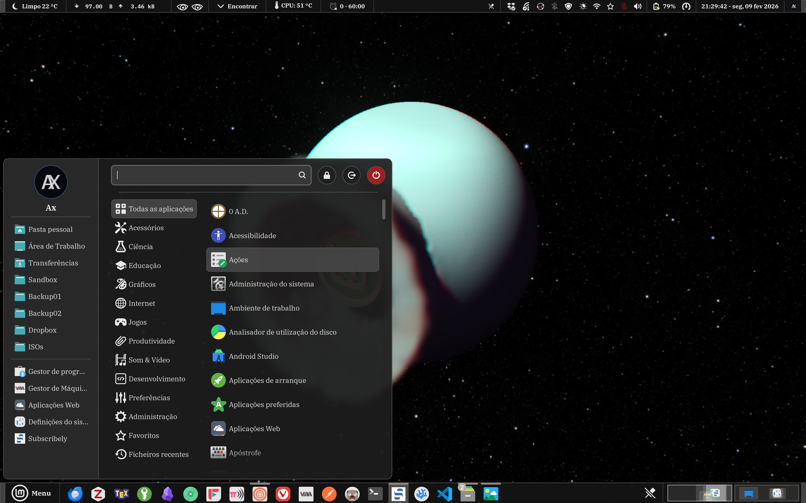
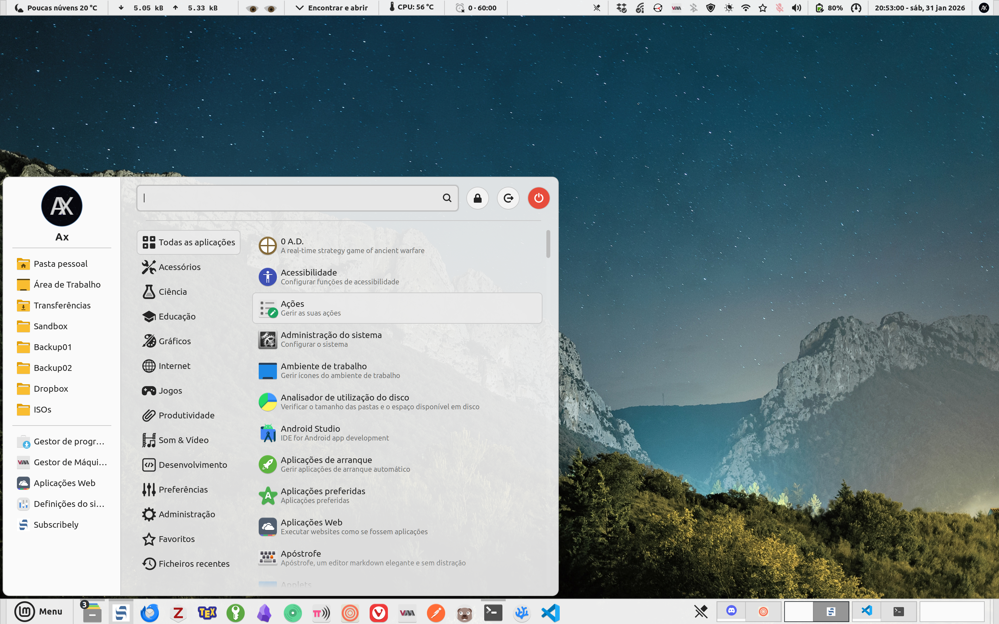

# Soul Cinnamon Theme

A Cinnamon DE theme with focus on consistency, adaptiveness, efficiency, and a modern look.

Open for contributions, just keep in mind the points above (for example regarding efficiency, using many heavy effects like box shadow or blur aren't advised since it makes the theme more resource intensive), plus make sure to take in account UX aspects for the theming.

Also the main source of truth regarding the most important theme components should be https://github.com/linuxmint/cinnamon/tree/master/data/theme.

## Screenshots


**Screenshot**: Soul Dark


**Screenshot**: Soul Light

## Structure

- `src/sass`: SASS source files.
- `src/assets`: Image assets (SVGs).
- `src/templates`: JSON templates for metadata.
- `dist`: Compiled theme output.

## Compiling

Dependencies:

- `sassc`

To build both Light and Dark variants:

```bash
make
```

To build specific variant:

```bash
make dark
# or
make light
```

## Customization

Edit `src/sass/_colors-soul-dark.scss` or `src/sass/_colors-soul-light.scss` to adjust the color palette. Edit `src/sass/_soul-main.scss` or widgets for structural changes.
